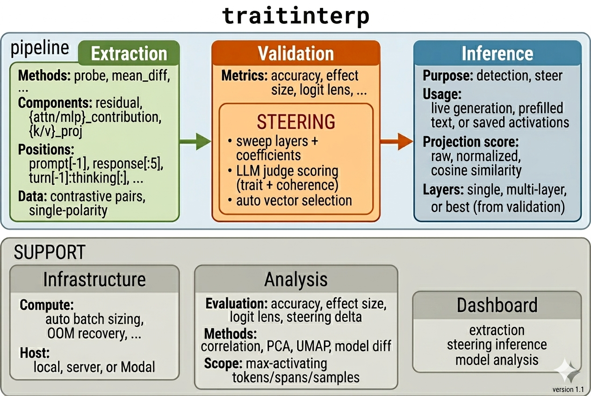

# Traitinterp: Open-Source Trait Vector Pipeline

I made a general-purpose repo for linear probes. Use it to start running your own linear probe experiments! https://github.com/ewernn/traitinterp

"Linear probes", "steering vectors", or as I like to call them, "trait vectors", are useful white-box AI interpretability and safety tools. We use them to monitor or steer a model's internal activations. We've used traitinterp to run many of our own experiments, and easily replicate papers like Anthropic's recent "Emotion Concepts" paper^[1] (link to companion post).

traitinterp supports most existing linear probe functionalities (extraction, steering, projection/monitoring, and a visualization dashboard), and is easily extensible to your custom use cases.

---

## What is a trait vector?

Linear directions in activation space encode many things — behavioral traits, emotions, syntax, tone, or any linear "feature" that can be "on" or "off" to create contrasting pairs. traitinterp supports all of these, but we focus on behavioral traits and emotions (e.g. sycophancy, concealment, or desperation).

A trait vector is a linear direction in activation space of how the AI represents/thinks about a trait. LLMs operationalize human traits to help accurately predict the next token, learned from large datasets of human stories, reasoning, and interaction patterns. For example, an LLM assistant responding to a grieving user has learned from observing therapists to employ empathy, concern, and professional restraint. Or a coding agent actively cheating on evals while producing benign reasoning might have learned this deception as a combination of concealment, rationalization, and desperation.

---

## Why trait vectors?

**Internal activations are the ground truth.** Output tokens can lie — chain-of-thought can be unfaithful, and models can reason from training data without any visible reasoning steps.^[1]

**They're cheap.** One probe is one dot product per token. You can run hundreds in parallel.

**You define what to look for.** SAE features are attributed post facto and expensive to train. Trait vectors start from a human-specified behavior — you write the contrastive scenarios, extract the direction, and validate it causally.

**They should scale.** Human-likeness is structurally baked into the training objective because language itself encodes humans and their psychology. From Anthropic's Persona Selection Model^[2]:

> "we expect dangerous AI behaviors and their causes to look familiar to humans, arising from personality traits like ambition, megalomania, paranoia, or resentment."

> "it may be productive to ... build and monitor activation probes for a researcher-curated set of traits like deception and evaluation awareness."

**They work.** From Anthropic's Emotion Concepts paper^[3]:

> "[Emotion] representations causally influence the LLM's outputs, including Claude's preferences and its rate of exhibiting misaligned behaviors such as reward hacking, blackmail, and sycophancy."

> "Desperation vector activation (and calm vector suppression) play a causal role in instances of reward hacking, where repeatedly failing to pass software tests leads the model to devise a 'cheating' solution."

## References

1. Evans, O. [Out-of-Context Reasoning in LLMs](https://outofcontextreasoning.com/). 2023.
2. Marks, S., Lindsey, J., Olah, C. [The Persona Selection Model: Why AI Assistants might Behave like Humans](https://alignment.anthropic.com/2026/psm/). Anthropic, 2026.
3. Sofroniew, N. et al. [Emotion Concepts and their Function in a Large Language Model](https://transformer-circuits.pub/2026/emotions/). Anthropic, 2026.

---

## How traitinterp works



The pipeline has three steps: extract a direction, validate it causally, then monitor with it.

### Quick tour

To run the full pipeline on a new model, you set up an experiment config and run three commands.

**Setup:** Create `experiments/{name}/config.json` pointing at your model:

```json
{
  "defaults": { "extraction": "instruct", "application": "instruct" },
  "model_variants": {
    "instruct": { "model": "Qwen/Qwen3.5-9B" }
  }
}
```

23 model configs ship with the repo (Llama, Qwen, Gemma, Mistral, DeepSeek, OLMo, Kimi K2). To add a new model, create a YAML in `config/models/` with its layer count and hidden dim.

**Extract** — generate contrastive responses, vet them, train probes across all layers:
```bash
python extraction/run_extraction_pipeline.py \
    --experiment live-chat \
    --category starter_traits \
    --load-in-4bit \
    --vet-responses --paired-filter
```

**Validate** — sweep layers and coefficients, score with LLM judge, auto-select the best vector:
```bash
python steering/run_steering_eval.py \
    --experiment live-chat \
    --traits starter_traits \
    --load-in-4bit \
    --direction positive
```

**Monitor** — generate responses on a prompt set, project per-token activations onto validated vectors:
```bash
python inference/run_inference_pipeline.py \
    --experiment live-chat \
    --prompt-set starter_prompts
```

Then open the dashboard:
```bash
python visualization/serve.py  # localhost:8000
```

[screenshot: extraction view]
[screenshot: steering view]
[screenshot: inference view]

9 starter traits ship ready to use: sycophancy, refusal, concealment, formality, optimism, hallucination, golden_gate_bridge, assistant_axis, evil. Adding your own trait is 4 text files — `positive.txt`, `negative.txt`, `definition.txt`, `steering.json` — no code changes.

---

## Selected findings

TODO

---

## Limitations & what's next

TODO
