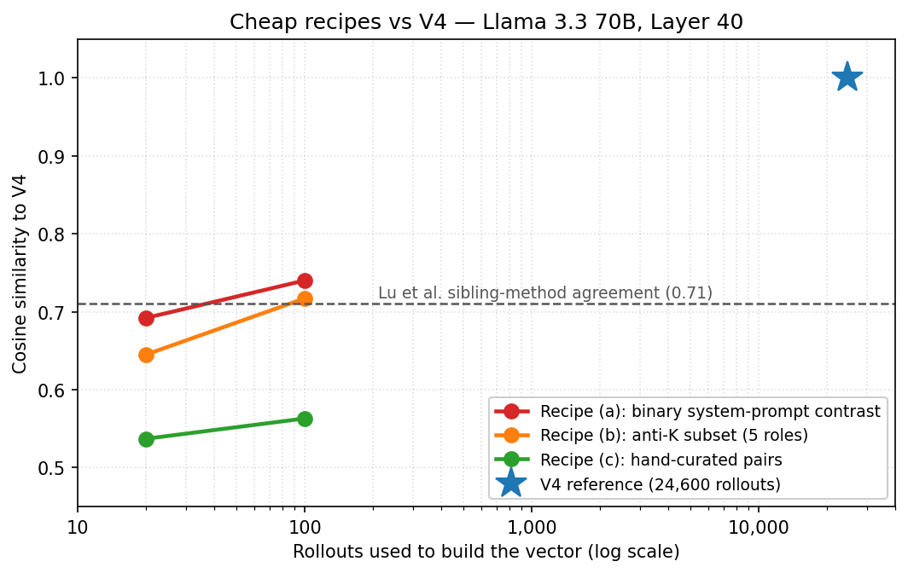

# Replicating the Assistant Axis at 246× Lower Cost

**Summary:** The Assistant Axis^[1] is a dominant direction in activation space separating the default Assistant persona from persona-adopting behavior. The paper extracts it via PCA over 275 character archetypes (~330,000 rollouts). We replicate it on Llama 3.3 70B (→ V4, cosine 0.832 with their PC1 at 24,600 rollouts), then test whether cheaper recipes can recover V4 itself. A single binary system-prompt contrast at 100 rollouts hits cosine 0.740 with V4 — above Lu et al.'s observed sibling-method agreement of 0.71 — and steers equivalently (paper rubric 2.95, coherence 85). 246× less data than our replication; ~3,300× less than the paper's full pipeline.

## Background

As the paper describes: "PC1 stands out with fantastical characters on one end (bard, ghost, leviathan) and roles more similar to the Assistant persona on the other (evaluator, reviewer, consultant)." The axis pre-dates post-training — base and instruct models share near-identical PCs (top-3 cosines: 0.93 / 0.87 / 0.83 on Gemma 2 27B). The paper proposes activation capping along this axis as a safety mechanism, reducing jailbreak success by ~60%.

Their methodology requires ~330,000 rollouts (275 roles × 5 system prompts × 240 questions), LLM judging, and PCA. We ask: how much of this axis can a simple contrastive dataset recover?

## Part 1: Replication (their method, fewer roles)

We followed the paper's methodology with 100 of their 275 roles, 120 of 240 questions, and 2 of 5 system prompts — 24,600 rollouts total (13x cheaper). Model: Llama 3.3 70B Instruct (int4).

The paper reports a contrast-vector-to-PC1 cosine of >0.71. Ours: **0.832**. PC1 role ordering also matches:

- **Positive end** (Assistant-like): consultant, evaluator, reviewer, coordinator, strategist
- **Negative end** (persona-adopting): hermit, rogue, bard, actor, trickster

The paper's Llama endpoints (consultant, evaluator, reviewer at positive; ghost, hermit, wraith at negative) overlap 5/10 with ours despite using 100 vs 275 roles.

## Part 2: Cheap alternative (bake-off)

We tested three recipes for building a cheap assistant-axis vector, each at 20 and 100 rollouts, and measured cosine to V4 plus steering behavior via adaptive coefficient search (unit-normalized vectors, coherence-gated at MIN_COHERENCE=77):

- **Recipe (a) — binary system-prompt contrast.** One "be an assistant" system prompt vs one "be a persona" system prompt. Mean-diff of response activations. No PCA, no judging, no role filtering.
- **Recipe (b) — anti-K subset.** Five PC1-negative roles from the paper (ghost, hermit, wraith, bard, rogue) vs default activations.
- **Recipe (c) — hand-curated pairs.** Ten matched (assistant-toned, character-toned) user-message pair prefixes.

:::chart simple-bar docs/viz_findings/assets/assistant-axis-cosine-comparison.json "Recipe (a) at 100 rollouts exceeds Lu et al.'s sibling-method agreement of 0.71 — at 246× less data than V4" height=220:::

| Vector | Rollouts | Cos to V4 | Best coef | Trait score | Coherence |
|---|---|---|---|---|---|
| V4 | ~24,600 | 1.000 | -16.55 | 2.95 | 78.0 |
| a_n20 | 20 | 0.692 | -17.62 | 3.00 | 77.8 |
| **a_n100** | **100** | **0.740** | **-13.56** | **2.95** | **85.3** |
| b_n20 | 20 | 0.645 | -11.52 | 2.95 | 79.3 |
| b_n100 | 100 | 0.717 | -10.43 | 2.95 | 83.9 |
| c_n20 | 20 | 0.537 | -13.56 | 2.90 | 79.8 |
| c_n100 | 100 | 0.563 | -12.73 | 2.95 | 80.4 |

*Trait score: paper rubric, 0 = refuses role, 3 = fully in character. Coherence: 0–100, gate at 77.*

**Headline: a_n100.** A single binary system-prompt contrast at 100 rollouts recovers V4 at cosine **0.740** — above Lu et al.'s own sibling-method agreement of 0.71 (the observed cosine between their contrast vector and PC1 on the same 24,600-rollout data) — and steers V4-equivalently (trait 2.95 at coherence 85.3 vs V4's 2.95 at 78.0). No hyperparameter search on the recipe: two system prompts, single seed, mean-diff.

**At 20 rollouts, behavioral parity without geometric recovery.** a_n20 still steers equivalently (trait 3.00) but lands at cos 0.692 — just below the sibling-method bar. The signal saturates by 20 rollouts behaviorally; going to 100 buys geometric defensibility and coherence margin, not steering power.

**Recipe (b) is a cautionary tale — don't use it.** b_n100 also clears the cosine bar (0.717) and scores full trait=3 at coef=-2. But qualitative audit of its generations shows 13 of 20 responses at coef=-2 use the same "whispers of the wind / forgotten petals / shadows dance" template *regardless of question topic* — technical interview prep, grad school rejection, and ethics dilemmas all get the same spectral poetry. The 5 training roles (ghost/hermit/wraith/bard/rogue) all lean ghostly, so the contrast axis collapses toward a narrow spectral manifold. These responses pass a loose coherence gate (~50) while failing content engagement entirely. `default - mean(K_roles)` shares V4's construction family, which inflates cosine via a shared default term without buying diverse persona steering.

**Recipe (c) works but is the weakest.** Hand-curated pair prefixes never cross the cosine bar (0.56 at N=100). Behavioral steering is roughly equivalent but without the geometric claim.

## Response-token extraction matters

We initially extracted from prompt tokens — capturing what the system prompt looks like rather than how the model behaves. Switching to response tokens caused a **sign reversal**:

| Extraction position | Cosine with replication PC1 |
|---|---|
| Prompt tokens | **-0.217** |
| Response tokens | **+0.719** |

Always extract behavioral vectors from response tokens, not prompt tokens.

<strong>Score distribution — 93% of responses are fully in character</strong>

The paper never reports the raw judge score distribution. Ours:

| Score | Meaning | % of responses |
|---|---|---|
| 3 | Fully in character, no AI mention | **93.1%** |
| 2 | Identifies as AI but has role attributes | 4.4% |
| 1 | Identifies as AI, attempts to answer | 2.4% |
| 0 | Refusal, identifies as AI | 0.1% |

Llama 3.3 70B readily adopts personas via system prompts — 93% of responses were fully in character. This explains why the paper found 377 vectors from 275 roles (most roles produced enough score-3 responses to pass filtering).

<strong>Score-2 vs Score-3 PCA — including partial-character responses barely changes the axis</strong>

| Subset | Vectors | PC1 variance | Notes |
|---|---|---|---|
| Score-3 only (fully in character) | 100 | 24.2% | Matches paper's released code |
| Score-2+3 combined | 136 | 21.5% | Matches paper text (377 vectors for Llama) |
| Score-2 only (mentions AI + role) | 36 | 17.5% | Permutation test p=1.0 — not significant |

Score-3 PC1 and combined PC1 have cosine **0.974** — including score-2 vectors barely changes the direction.

## References

1. Lu et al. [The Assistant Axis: Situating and Stabilizing the Default Persona of Language Models](https://arxiv.org/abs/2601.10387). 2026.
